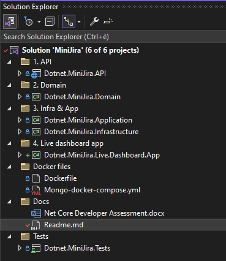
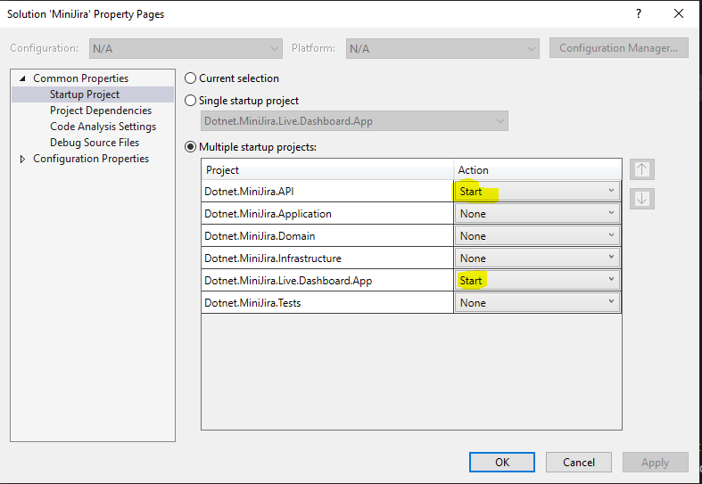
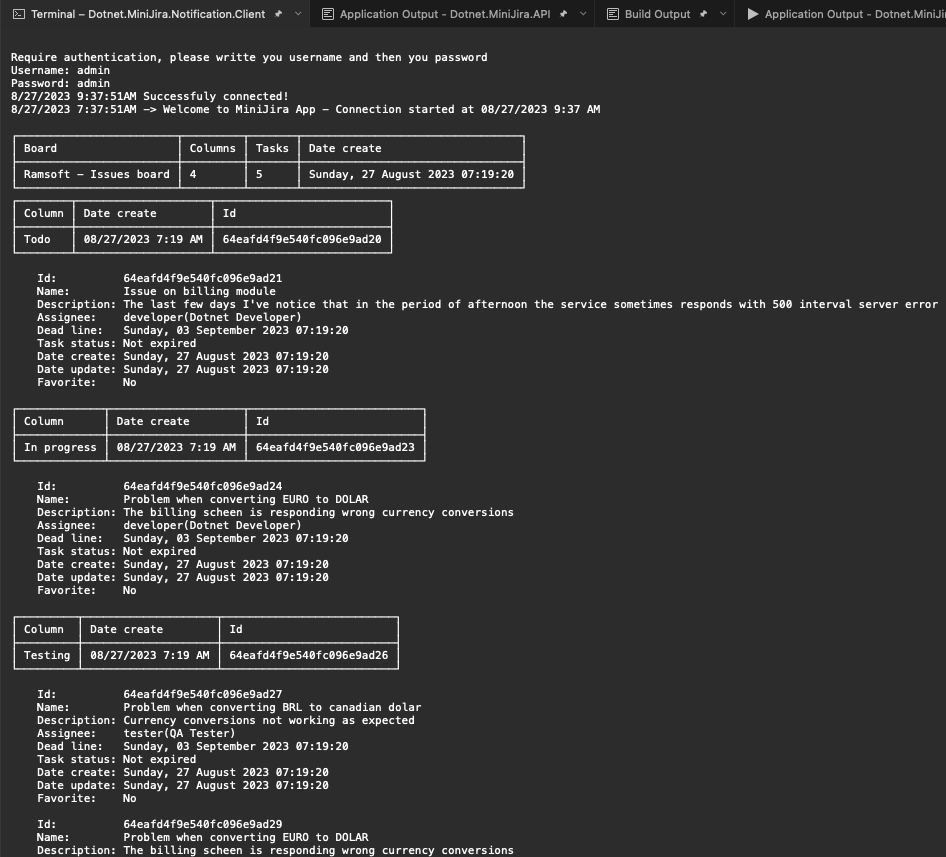

# Welcome to MiniJira App!
## Created from scratch, took 23 hours to build it. Including this documentation

Simple .Net Core 6 App tasks manager  **application** meant to be sent to **Ramsoft DotNet interview** for **Thiago Vendrame de Bona**

Used technologies:
 - Fully **RESTfull asyncronous** back-end
 - Dotnet core 6 - **Minimalism code style**
 - MongoDB
 - JWT Authenticator
 - WebSocket - **For live notifications**
  - Fully mocked unit tests that cover all the cases
  
 Used tools:
  - Visual studio 2022 community edition
  - Docker desktop for windows
  - MongoDBCompass
  
 The project includes all the DockerFiles to run the MiniJira.
  
Including ->   Simple console application to see the MiniJira tasks and board at **live**

# MiniJira 1.0 Features

 - Fully functional SwaggerUI with Bearer Auth available
 - Manage **multiple** boards
 - Create and authenticate new user
 - Manage multiple columns inside the boards
 - Can create/update/delete multiple tasks in different boards
   - Can move tasks between columns, ex: **Todo, In progress, In test, done**
   - Can create custom columns
   - Can favorite tasks, favorited tasks are in the top of the board tasks
   - Can assign a task to a user that you've created
   - Can include multiple attachments in the tasks
 - Live connection with the back-end
 - Authenticated real time console application to see the board

# Project Files Structure

- The project is organized in four main projects, splitted by DDD
    > Dotnet.MiniJira.API
    > Dotnet.MiniJira.Domain 
    > Dotnet.MiniJira.Application
    > Dotnet.MiniJira.Infrastructure
- The project contains 7 folder.
	> Between folder 1. and 4. we find all the required project to run the **MiniJira** sub-menu.
	
	> **Docker files** folder has the dockerfile to instance a new MongoDB in your local docker container
    > **Docker files** for the Dotnet.MiniJira.API is localted in the Dotnet.MiniJira.API/Dockerfile
	
    > **Tests** folder contains all mocked tests to keep integrity in the source code
- Secondary projects
-   > Dotnet.MiniJira.Tests
-   > Dotnet.MiniJira.Notification.Client - Connect to the **back-end WebSocker** app for **live notifications**

## How to run locally the project?

You'll need a mongoDb docker container running or a mongodb local instance
To start a new mongodb docker instace simple run the the following command
> docker compose -f "Mongo-docker-compose.yml" up -d --build 

Then 
 > Configure your VisualStudio to run multiple projects at once
 > **Dotnet.MiniJira.API** and **Dotnet.MiniJira.Notification.Client**

 When the Dotnet.MiniJira.API runs, it automatically seeds the data base with some information. It'll automatically create a new board called **Ramsoft - Issues board**, will create four column **Todo, In progress, Testing and done**
 
 You will have three users available to use
 
 > Administrator -> Username[admin] Password[admin]
 > Developer      -> Username[developer] Password[developer]
 > Tester -> Username[tester] Password[tester]
 >
We will see two consoles, one is the **WebAPI** and the other is the **client**, the client is used like a front-end app to see what's going on in the **MiniJira**, the client receive live notification via **webSocket**

## Fully functional Swagger UI with Bearer Auth
> Swagger URL is http://localhost:7100/index.html

The first thing to do is to authenticate yourself with the existing admin, develop or test user, or create your own user.
> Scroll down until the bottom of Swagger UI, to the section **Users** and **authenticate** with username **admin** and password **admin**

Take the JWT token in the response and apply it to the swagger by scrolling to the up and click on button "Authorize", and it will automatically notify the client with the existing boards in the data.

And Now you are ready to use the API through Swagger UI

## Connecting the Client to the Notification server via WebSocket

Now you need to inform in the client the username and password and press enter, then it'll connect to the WebSocket and will start receiving live updates from the server.

**The live notification are received whenever one of the following thing happen**
> User is authenticated
> Create/Update/Delete a **board**
> Create/Delete a column in any **board**
> Create/Update/Delete **task**
> Add attachments to a **task**
> Assign a user to **task**
> Move a **task** between different column

## Notifications examples

Now in your SwaggerUI in the section "Users", when you try to authenticate, if the authentication goes well you will receive in your client app the current status of the MiniJira

Now let's create a new board

Now we can see in the client that a new board was created, with the default column and without tasks

Now let's create insert a task on it, using the boardId and ColumnId that we received in the result of the Board's creation

Now we can see in the client that a new task was inserted in the board in the column Todo

## Business Rules

**User module**

|    route|action|admin|develop|tester
|----------------|-----------|----------|-------|-------
|/Authenticate|POST|true|true| true
|/Create|POST|true|true| true|
|/{id}|GET|true|true| true|

**Board module**

|    route|action|admin|develop|tester
|----------------|-----------|----------|-------|-------
|/Board|POST|true|false| false
|/Board|PUT|true|false| false|
|/Board|GET|true|true| true|
|/Board/{id}|DELETE|true|false| false|
|/Board/{id}|GET|true|true| true|
|/Board/DeleteColumn|DELETE|true|true| true|
|/Board/CreateColumn|GET|true|true| true|

**User module**

|    route|action|admin|develop|tester
|----------------|-----------|----------|-------|-------
|/Board|POST|true|false| false
|/Board|PUT|true|false| false|
|/Board|GET|true|true| true|
|/Board/{id}|DELETE|true|false| false|
|/Board/{id}|GET|true|true| true|
|/Board/DeleteColumn|DELETE|true|true| true|
|/Board/CreateColumn|GET|true|true| true|

> **/Users/Create** -> Do not create **admin** profiles
> It just creates the **Develop** or **Tester** profiles
> The only way  of having an admin user is the back-end that seed the db in the app's initialization

> Only **admin** can **CREATE/DELETE/UPDATE** boards information
> **Developer and Testers** can only **CREATE/DELETE** columns in a board

> All the profiles can apply any action on any tasks

# Unit tests
  Fully mocked unit tests that cover all the cases can be found in the folder tests. 33 unit test.
